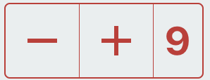

# react-native-simple-stepper

[](https://reactnative.dev)
[](https://www.npmjs.com/package/react-native-simple-stepper)
[](https://www.npmjs.com/package/react-native-simple-stepper)
[](https://travis-ci.org/testshallpass/react-native-simple-stepper)
[](https://codecov.io/gh/testshallpass/react-native-simple-stepper)
[](https://raw.github.com/testshallpass/react-native-simple-stepper/master/LICENSE)

A simple react-native implementation of the [UIStepper](https://developer.apple.com/reference/uikit/uistepper) control from iOS. To note, customization is available, see [Props](#props) for more info.

## Table of contents

* [Installation](#installation)
* [Usage](#usage)
* [Using Text Position](#Using-Text-Position)
* [Props](#props)
  * [Values](#values)
  * [Functions](#functions)
  * [Styles](#styles)

## Installation

* ```yarn add react-native-simple-stepper```
* ```npm install react-native-simple-stepper --save```

## Usage

```javascript
import React, { Component } from 'react';
import { SimpleStepper } from 'react-native-simple-stepper';

export default class App extends Component {
  constructor(props) {
    super(props);
    this.state = { value: 0 };
  }
  _valueChanged = value => {
    this.setState({ value });
  };
  render() {
    return <SimpleStepper valueChanged={value => this._valueChanged(value)} />;
  }
}
```

## Using Text Position

First, set prop `showText` to `true`. Second, set prop `textPosition` to be `left`, `center` or `right` (default: `center`). Third, profit. It will render as a `<Text/>` component by default or you can override it with `renderText` prop. Example layouts:

| Left | Center | Right |
| :---: | :---: | :---: |
|  |  | 

## Props

### Values

| Name | Type | Description | Default |
| --- | :---: | --- | --- |
| ```initialValue``` | Number  | initial value | 0
| ```minimumValue``` | Number  | minimum value | 0
| ```maximumValue``` | Number  | maximum value | 10
| ```stepValue``` | Number  | step value (ex. increment by 10) | 1
| ```incrementImage``` | String or Number  | network or local image | require('./assets/increment.png')
| ```decrementImage``` | String or Number  | network or local image | require('./assets/decrement.png')
| ```activeOpacity``` | Number  | touch opacity | 0.4
| ```disabledOpacity``` | Number  | when step button is disabled | 0.5
| ```disabled``` | Boolean  | stepper disable state | false
| ```wraps``` | Boolean  | whether or not it wraps. [more info](https://developer.apple.com/documentation/uikit/uistepper/1624068-wraps) | false
| ```showText``` | Boolean  | whether or not to show text component | false
| ```textPosition``` | String  | placement of the text component | center

### Functions

| Name | Type | Description | Default |
| --- | :---: | --- | --- |
| ```valueChanged``` | Function  | invoked when value changes | `() => {}`
| ```onMin``` | Function  | invoked when value reaches `minimumValue` | `() => {}`
| ```onMax``` | Function  | invoked when value reaches `maximumValue` | `() => {}`
| ```onIncrement``` | Function  | invoked each time value increments | `() => {}`
| ```onDecrement``` | Function  | invoked each time value decrements | `() => {}`
| ```renderDecrementImage``` | Function  | used to override decrement image component | `undefined`
| ```renderIncrementImage``` | Function  | used to override increment image component | `undefined`
| ```renderDecrementStep``` | Function  | used to override decrement step component | `undefined`
| ```renderIncrementStep``` | Function  | used to override increment step component | `undefined`
| ```renderText``` | Function  | used to override text component when `showText` is true (defaults to `Text/>`) | `undefined`

### Styles

| Name | Type | Description | Default |
| --- | :---: | --- | --- |
| ```textStyle``` | Object  | text component style | `{ padding: 8, fontSize: 20, fontWeight: 'bold', color: 'blue' }`
| ```containerStyle``` | Object  | container component style | `{ backgroundColor: 'transparent', flexDirection: 'row', borderWidth: 2, borderRadius: 8, overflow: 'hidden', alignItems: 'center', borderColor: 'blue' }`
| ```separatorStyle``` | Object  | separator component style | `{ width: StyleSheet.hairlineWidth, backgroundColor: 'blue', height: '100%' }`
| ```incrementStepStyle``` | Object  | increment step component style | `{ padding: 8 }`
| ```decrementStepStyle``` | Object  | decrement step component style | `{ padding: 8 }`
| ```incrementImageStyle``` | Object  | increment image component styles | `{ height: 36, width: 36 }`
| ```decrementImageStyle``` | Object  | decrement image component styles | `{ height: 36, width: 36 }`
