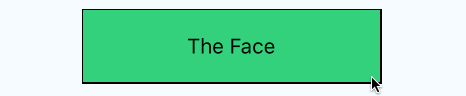
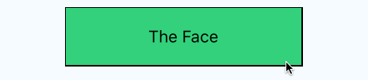
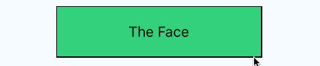

## Simple

```
import FlipCard from 'react-native-flip-card'

<FlipCard>
  {/* Face Side */}
  <View style={styles.face}>
    <Text>The Face</Text>
  </View>
  {/* Back Side */}
  <View style={styles.back}>
    <Text>The Back</Text>
  </View>
</FlipCard>
```

## Customized

```
<FlipCard
  style={styles.card}
  friction={6}
  perspective={1000}
  flipHorizontal={true}
  flipVertical={false}
  flip={false}
  clickable={true}
  onFlipEnd={(isFlipEnd)=>{console.log('isFlipEnd', isFlipEnd)}}
>
  {/* Face Side */}
  <View style={styles.face}>
    <Text>The Face</Text>
  </View>
  {/* Back Side */}
  <View style={styles.back}>
    <Text>The Back</Text>
  </View>
</FlipCard>
```

# Props

## flip(bool) `Default: false`

If you change default display side, you can set `true` to this param. If you change side, you can pass `bool` variable dynamically.

## clickable(bool) `Default: true`

If you want to disable click a card, you can set `false` to this param.

## friction(number) `Default: 6`

The friction of card animation

## perspective(number) `Default: 0`

The amount of perspective applied to the flip transformation

## flipHorizontal(bool) `Default: false`

If you set true, a card flip to horizontal.



## flipVertical(bool) `Default: true`

If you set false, a card not flip to vertical. If you set true both `flipHorizontal` and `flipVertical` , a card flip to diagonal.

| vertical                     | diagnoal                     |
| ---------------------------- | ---------------------------- |
|  |  |

## onFlipStart(function) `(isFlipStart) => {}`

When a card starts a flip animation, call `onFlipEnd` function with param.

## onFlipEnd(function) `(isFlipEnd) => {}`

When a card finishes a flip animation, call `onFlipEnd` function with param.

## alignHeight(boolean) `Default:false`

If you pass `true` to `alignHeight` param, the card keep height of bigger side.

## alignWidth(boolean) `Default:false`

If you pass `true` to `alignWidth` param, the card keep width of bigger side.

## useNativeDriver(boolean) `Default:false`

If you pass `true` to `useNativeDriver` param, the card animation will utilize the native driver.
